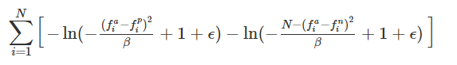

# Identifying Black-listed speakers
Here I have implemented and trained a model to detect if a particular speaker is black_listed or not. The data has been used from [MCE 2018 challange.](http://mce.csail.mit.edu/) The data contains a 600 dimentional ivector for each speaker.    
My model uses the structure from this [paper](https://arxiv.org/pdf/1910.01463v2.pdf).

# Model
 The model is a simple ANN which maps each ivector into a 1000 dimentional latent space, where it attempts to cluster blacklisted speakers and non-blacklisted speakers. The model uses a Triplet loss while training. where each triplet is 
 ```
 [Normal_speaker1 ,Normal_speaker2,black_listed_speaker] 
 ```
 The Normal_speaker1 acts as anchor and the rest as positive and negative examples respectively.
 
 ### Loss function
  The standard loss function is  
  
    
  
  But I use a different [loss_less](https://towardsdatascience.com/lossless-triplet-loss-7e932f990b24) loss function. For this to work we have to constrain the final layer of the model with a Sigmoid activation function.  
  
  The loss function used here is...  
    
  Where ```N``` and ```beta``` are both set equal to the dimention of the latent space we are projecting the speakers in. 
  
  
  # Evaluation
  At test time, provided with an unknown ivector I use KNN with K = 3, and the average method to label the person as black_listed or not.
  
  
  
  

